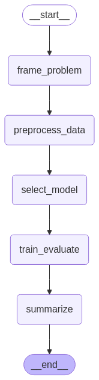

# 🤖 AutoML Agent Collective — AI Building an AI

> Built with [LangChain](https://www.langchain.com/), [LangGraph](https://www.langgraph.dev/), and classic ML tools.

---

## 🧠 What It Is

A **multi-agent system** of LLMs that automates the entire machine learning pipeline — from problem framing to feature engineering, model selection, tuning, and evaluation — using a graph of cooperating agents.

Think of it as an **AI-powered ML team**, where each agent has a role, a purpose, and memory. Together, they solve real-world ML tasks, with minimal human input.

---

## 🎯 What It Does

- **Frames the problem** (detects target, task type, metrics)
- **Engineers features** (encoding, imputing, scaling)
- **Selects models** (based on task type & data)
- **Evaluates performance** (plots, metric)

All driven by LLM agents orchestrated through **LangGraph**.

---

## 🧱 Architecture

The architecture consists of interconnected agents, each responsible for a specific stage of the ML pipeline. These agents communicate through a shared graph structure, enabling seamless collaboration and task delegation.

---

## 🛠️ Tech Stack

| Layer         | Tool                             |
|---------------|----------------------------------|
| Orchestration | [`LangGraph`](https://www.langgraph.dev/)      |
| Agent Logic   | [`LangChain`](https://www.langchain.com/) + Google Gemini Flash 2.0 |
| Data Handling | `pandas`, `scikit-learn`         |
| Evaluation    | `matplotlib`, `sklearn.metrics`  |
| Memory        | Shared app state |

---

## 🚀 Running It

The app is deployed on Streamlit and can be accessed via the following [link](https://aregspz-automl-agent-collective-main-naqz5l.streamlit.app/). Streamlit is a high level framework which handles the complexities of web frontend and provides a convenient environment for pushing Data projects into production.

Once you enter the website, you will be asked to provide the business goal, the dataset in csv format, and a couple of optional parameters.
> Note: the system is optimized for solving classical Machine Learning problems like classificication and regression. Prompting it to solve a Deep Learning problem will yield unexpected results. 
Once you click Run, the agents will take over, step by step. If something goes unexpectedly, the agents will go back to the start and try again.

## End Result

At the end, you will recieve a summary of what was done by the system, get visualizations (if Verbose output is set), and the trained model, which you will be able to download and use for your task.